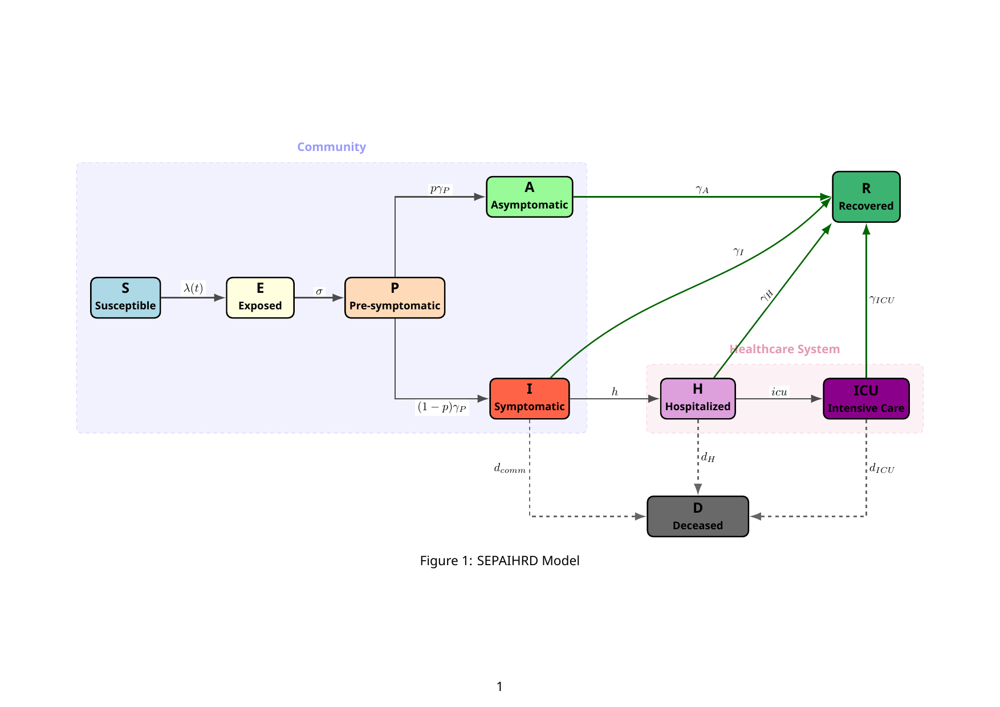

# Mathematical Modeling of SARS-CoV-2 Dynamics in Spain (SEPAIHRD) + SIR Framework

This C++ project implements and calibrates an age-structured deterministic compartmental model (SEPAIHRD) to simulate SARS-CoV-2 dynamics in Spain (2020). It also includes a small framework of classic SIR variants (deterministic, stochastic, and with vital dynamics), plus Bayesian calibration (MCMC) and post-calibration analysis.

## Table of Contents

- [Features](#features)
- [Quickstart](#quickstart)
- [Post-Calibration Report (HTML)](#post-calibration-report-html)
- [Models Implemented](#models-implemented)
- [SEPAIHRD Model Equations](#sepaihrd-model-equations)
- [Technologies Used](#technologies-used)
- [Prerequisites](#prerequisites)
- [Installation](#installation)
- [Project Structure](#project-structure)
- [Usage](#usage)
    - [Running Simulations](#running-simulations)
    - [Input Data](#input-data)
    - [Output Data](#output-data)
- [Configuration](#configuration)
- [Running Tests](#running-tests)
- [Memory Checking](#memory-checking)
- [Scripts](#scripts)
- [Contributing](#contributing)
- [License](#license)
- [References](#references)
- [Contact](#contact)

## Features

*   **SEPAIHRD Model:**
    *   Age-structured (4 age groups: 0-30, 30-60, 60-80, 80+) deterministic model.
    *   Estimates hidden dynamics (e.g., true prevalence).
    *   Incorporates piece-wise constant Non-Pharmaceutical Interventions (NPIs).
*   **Base SIR Framework:**
    *   Standard deterministic SIR model.
    *   Stochastic SIR model using the Gillespie algorithm or binomial chain method.
*   **Simulation Engine:**
    *   Flexible simulation engine for running models over time.
    *   Support for various ODE solver strategies (e.g., Dopri5, Cash-Karp, Fehlberg).
*   **Calibration Framework:**
    *   Bayesian calibration using MCMC (Metropolis-Hastings).
    *   Optimization algorithms (e.g., Particle Swarm Optimization, Hill Climbing) for finding initial parameters.
    *   Objective functions (e.g., Poisson likelihood).
*   **Post-Calibration Analysis (Refactored Architecture):**
    *   Modular component-based design with dependency injection
    *   Performance optimizations: simulation caching (~2x speedup), asynchronous I/O (150x faster), in-memory aggregation (3-5x faster)
    *   Comprehensive analysis: posterior predictive checks, scenario analysis, validation against external data
    *   Interface-based design enabling unit testing and mocking
*   **Modular Design:**
    *   Uses interfaces for models, ODE solvers, optimization algorithms, parameter managers, and objective functions, promoting extensibility.
    *   Includes utility classes for file operations, CSV parsing, data handling, and logging.
*   **Data Output:**
    *   Simulation results, calibration outputs (e.g., MCMC chains, summary statistics), and logs can be saved to CSV and text files.
*   **Testing:**
    *   Unit tests using Google Test framework.
*   **Memory Checking:**
    *   Integrated Valgrind support for memory leak detection.

## Quickstart

```bash
# From the repo root
cmake -S . -B build -DCMAKE_BUILD_TYPE=Release
cmake --build build -j

# Run calibration (examples)
./build/sepaihrd_age_structured_main --algorithm hill
./build/sepaihrd_age_structured_main --algorithm pso

# Run tests
ctest --test-dir build
```

## Post-Calibration Report (HTML)

- Report file: [data/output/PostCalibrationFigures/analysis_report.html](data/output/PostCalibrationFigures/analysis_report.html)

Viewing notes:

- GitHub does not reliably render repository HTML files directly inside the README. For best results, open the file locally in a browser.

## Models Implemented

1.  **Age-Structured SEPAIHRD Model:** The primary model for simulating SARS-CoV-2 dynamics.
    *   Implemented in `src/model/` and `include/model/`.
    *   Key classes: [`AgeSEPAIHRDModel`](include/model/AgeSEPAIHRDModel.hpp), [`AgeSEPAIHRDSimulator`](include/model/AgeSEPAIHRDsimulator.hpp), [`SEPAIHRDModelCalibration`](include/model/SEPAIHRDModelCalibration.hpp), [`PieceWiseConstantNPIStrategy`](include/model/PieceWiseConstantNPIStrategy.hpp).
2.  **Age-Structured SIR Model:** A generic age-structured SIR model.
    *   Implemented in `src/sir_age_structured/` and `include/sir_age_structured/`.
    *   Key classes: [`AgeSIRModel`](include/sir_age_structured/AgeSIRModel.hpp), [`ModelCalibrator`](include/sir_age_structured/ModelCalibrator.hpp).
3.  **Standard Deterministic SIR Model:**
    *   Implementation based on [`SIRModel.hpp`](include/base/SIRModel.hpp) and [`SIRModel.cpp`](src/base/SIRModel.cpp).
4.  **SIR Model with Population Dynamics (Vital Dynamics):**
    *   Implementation based on [`SIR_population_variable.hpp`](include/base/SIR_population_variable.hpp) and [`SIR_population_variable.cpp`](src/base/SIR_population_variable.cpp).
5.  **Stochastic SIR Model:**
    *   Implementation based on [`SIR_stochastic.hpp`](include/base/SIR_stochastic.hpp) and [`SIR_stochastic.cpp`](src/base/SIR_stochastic.cpp).

## SEPAIHRD Model Equations

<p align="center">
  
  <br>
  <em>Figure: SEPAIHRD compartment flow diagram with community and healthcare system compartments.</em>
</p>

The primary model is an age-structured SEPAIHRD system with compartments per age class $i \in \{0,\dots,n-1\}$:

- $S_i$: susceptible
- $E_i$: exposed (latent)
- $P_i$: presymptomatic
- $A_i$: asymptomatic infectious
- $I_i$: symptomatic infectious
- $H_i$: hospitalized
- $\mathrm{ICU}_i$: intensive care
- $R_i$: recovered
- $D_i$: deceased
- $\mathrm{CumH}_i$: cumulative hospital admissions (bookkeeping)
- $\mathrm{CumICU}_i$: cumulative ICU admissions (bookkeeping)

### Force of infection (age-structured)

Let:

- $N_i$ be the population size in age class $i$
- $M_{ij}$ be the baseline contact matrix entry (contacts from age class $i$ with $j$)
- $a_i$ be relative susceptibility
- $h^{\mathrm{inf}}_i$ be relative infectiousness
- $\theta$ scale symptomatic transmissibility (as implemented: symptomatic contribution is $\theta I$)
- $\beta(t)$ be the transmission rate (optionally piecewise-constant)
- $\kappa(t)$ be the NPI “reduction factor” (piecewise-constant; defaults to baseline during the run-up and early period)

Define the infectious pressure in age class $j$:

$$
\pi_j(t) = \frac{h^{\mathrm{inf}}_j}{N_j}\left(P_j(t) + A_j(t) + \theta\, I_j(t)\right)
$$

Then the force of infection for age class $i$ is:

$$
\lambda_i(t) = \beta(t)\,\kappa(t)\, a_i \sum_{j=0}^{n-1} M_{ij}\,\pi_j(t)
$$

### Compartment dynamics

With parameters:

- $\sigma$: $E \to P$ progression rate
- $\gamma_p$: $P \to (A,I)$ progression rate
- $\gamma_A$: recovery rate from $A$
- $\gamma_I$: recovery rate from $I$
- $\gamma_H$: recovery rate from $H$
- $\gamma_{\mathrm{ICU}}$: recovery rate from ICU
- $p_i$: fraction becoming asymptomatic
- $h_i$: hospitalization rate from $I$
- $\mathrm{icu}_i$: ICU admission rate from $H$
- $d^{H}_i$: hospital mortality rate
- $d^{\mathrm{ICU}}_i$: ICU mortality rate
- $d^{\mathrm{comm}}_i$: community/nursing home mortality (direct $I \to D$)

The ODE system for each age class $i$ is:

$$
\begin{aligned}
\frac{dS_i}{dt} &= -\lambda_i S_i \\
\frac{dE_i}{dt} &= \lambda_i S_i - \sigma E_i \\
\frac{dP_i}{dt} &= \sigma E_i - \gamma_p P_i \\
\frac{dA_i}{dt} &= p_i\,\gamma_p P_i - \gamma_A A_i \\
\frac{dI_i}{dt} &= (1-p_i)\,\gamma_p P_i - (\gamma_I + h_i + d^{\mathrm{comm}}_i) I_i \\
\frac{dH_i}{dt} &= h_i I_i - (\gamma_H + d^{H}_i + \mathrm{icu}_i) H_i \\
\frac{d\mathrm{ICU}_i}{dt} &= \mathrm{icu}_i H_i - (\gamma_{\mathrm{ICU}} + d^{\mathrm{ICU}}_i)\,\mathrm{ICU}_i \\
\frac{dR_i}{dt} &= \gamma_A A_i + \gamma_I I_i + \gamma_H H_i + \gamma_{\mathrm{ICU}}\,\mathrm{ICU}_i \\
\frac{dD_i}{dt} &= d^{\mathrm{comm}}_i I_i + d^{H}_i H_i + d^{\mathrm{ICU}}_i\,\mathrm{ICU}_i \\
\frac{d\mathrm{CumH}_i}{dt} &= h_i I_i \\
\frac{d\mathrm{CumICU}_i}{dt} &= \mathrm{icu}_i H_i
\end{aligned}
$$

Notes:

- $\mathrm{CumH}$ and $\mathrm{CumICU}$ are cumulative counters; they do not contribute to population conservation.
- In the current implementation, $\kappa(t)$ multiplies $\beta(t)$ (i.e., it scales transmission) and is piecewise constant (see `PiecewiseConstantNpiStrategy`).

## Technologies Used

*   **Programming Language:** C++
*   **Build System:** CMake (version 3.10 or higher)
*   **Major Libraries:**
    *   **Eigen3 (version 3.3+):** For linear algebra operations (matrices, vectors).
    *   **Google Test:** For unit testing.
    *   **GSL (GNU Scientific Library):** For numerical integration and random number generation.
    *   **Boost Libraries:** (Specifically `system` and headers).

## Prerequisites

*   **C++ Compiler:** A C++ compatible compiler (e.g., GCC, Clang, MSVC).
*   **CMake:** Version 3.10 or newer.
*   **GSL (GNU Scientific Library):** Must be installed on your system.
*   **Eigen3 Library:** Must be installed or accessible by CMake.
*   **Boost Libraries:** (Specifically `system` and headers). Must be installed or accessible by CMake.
*   **Git:** For cloning the repository.

### Ubuntu / Debian

```bash
sudo apt-get update
sudo apt-get install -y \
    build-essential \
    cmake \
    libgsl-dev \
    libeigen3-dev \
    libboost-system-dev \
    libgtest-dev \
    libomp-dev
```

Notes:
- Some distros provide OpenMP via GCC packages; if `libomp-dev` is unavailable, you can typically omit it and rely on `g++`.

## Installation

1.  **Clone the repository:**
    ```bash
    git clone https://github.com/aldjoted/Mathematical-Modeling-Of-Infectious-Diseases-V1.git
    ```
2.  **Enter the project directory:**
    ```bash
    cd Mathematical-Modeling-Of-Infectious-Diseases-V1
    ```
3.  **Configure and build (recommended):**
    ```bash
    cmake -S . -B build -DCMAKE_BUILD_TYPE=Release
    cmake --build build -j
    ```

Notes:
- Depending on your CMake generator/IDE, executables may be placed directly under `build/` (e.g., `build/sepaihrd_age_structured_main`) rather than `build/bin/`.

## Project Structure

The project is organized as follows:

*   `CMakeLists.txt`: The main CMake build script for the project.
*   `Readme.md`: This file.
*   `build/`: Build directory created by CMake. Contains compiled executables and other build artifacts.
*   `data/`: Contains input data, configuration files, and output results.
    *   `data/contacts.csv`: Contact matrix used by age-structured models.
    *   `data/configuration/`: Parameter + algorithm settings (initial guess, bounds, MCMC/PSO/Hill settings, etc.).
    *   `data/processed/`: Processed epidemiological time series used for calibration (e.g., `processed_data.csv`).
    *   `data/output/`: Simulation outputs written by the C++ executables.
    *   `data/checkpoints/`: Optimizer checkpoints / final parameter dumps.
    *   `data/mcmc_samples/`: MCMC samples and checkpoints.
    *   `data/raw/`: Raw input data (if present).
    *   `data/visualizations/`: Figures generated by scripts.
*   `docs/`: Contains additional documentation. This may include Doxygen-generated API documentation, detailed model descriptions, calibration methodology explanations, or design documents outlining the software architecture.
    *   `docs/INDEX.md`: Documentation entry point.
    *   `docs/IMPLEMENTATION_SUMMARY.md`, `docs/COMPLETE_IMPLEMENTATION_SUMMARY.md`: Implementation summaries.
    *   `docs/diagrams/`: Model diagrams (e.g., `SEPAIHRD_Model_Diagram.png`).
*   `include/`: Contains header files (`.hpp`) for the C++ source code.
    *   `include/base/`: Header files for base SIR models.
    *   `include/exceptions/`: Custom exception classes.
    *   `include/model/`: Header files for the SEPAIHRD model and related components (parameters, objectives, optimizers).
        *   `include/model/interfaces/`: Interface definitions for modular components (ISimulationRunner, IMetricsCalculator, IAnalysisWriter, IResultAggregator).
        *   `include/model/AnalysisTypes.hpp`: POD structures for data transfer between components.
    *   `include/sir_age_structured/`: Header files for the age-structured SIR model and related components.
    *   `include/utils/`: Utility class headers (e.g., [`FileUtils.hpp`](include/utils/FileUtils.hpp), [`Logger.hpp`](include/utils/Logger.hpp), CSV parsing).
*   `scripts/`: Contains utility scripts, possibly for data processing, visualization, or running batches of simulations. See [Scripts Section](#scripts) for more details.
    *   `scripts/age-structured-calibration/`: Scripts related to calibrating age-structured models.
    *   `scripts/data-processing/`: Scripts for processing data.
    *   `scripts/data-visualization/`: Scripts for visualizing results.
    *   `scripts/utils/`: Utility scripts.
*   `src/`: Contains C++ source code implementation files (`.cpp`).
    *   `src/base/`: Source files for base SIR models.
        *   `src/base/main/`: Main executable files for the base SIR models.
        *   `src/base/docs/`: Markdown documentation for the base models.
    *   `src/exceptions/`: Source files for custom exception classes.
    *   `src/model/`: Source files for the SEPAIHRD model, including its main executable (`main.cpp`), objectives, optimizers, and parameter management.
        *   Modular post-calibration analysis components: `SimulationRunner.cpp`, `MetricsCalculator.cpp`, `AnalysisWriter.cpp`, `ResultAggregator.cpp`.
    *   `src/sir_age_structured/`: Source files for the age-structured SIR model, including its main executable (`main.cpp`), calibration demo, objectives, optimizers, etc.
    *   `src/utils/`: Utility class implementations.
*   `tests/`: Contains unit tests for the project, using the Google Test framework.
    *   `tests/model/`: Tests for the SEPAIHRD model.
    *   `tests/sir_age_structured/`: Tests for the age-structured SIR model.
    *   `tests/utils/`: Tests for utility classes.

## Usage

### Running Simulations

Executables are built into the build directory (commonly `build/`).

*   **SEPAIHRD Age-Structured Model:**
    The main executable for the SEPAIHRD model is `sepaihrd_age_structured_main`.
    ```bash
    ./build/sepaihrd_age_structured_main [options]
    ```
    Available options (see `src/model/main.cpp` for details):
    *   `--algorithm <name>` or `-a <name>`: Choose calibration algorithm.
        *   `pso` or `psomcmc`: Particle Swarm Optimization followed by MCMC (default).
        *   `hill` or `hillmcmc`: Hill Climbing followed by MCMC.
    *   `--help` or `-h`: Show help message.
    
    The executable performs model calibration followed by comprehensive post-calibration analysis using a modular, performance-optimized architecture.

*   **Age-Structured SIR Model:**
    Run the main simulation:
    ```bash
    ./build/sir_age_structured_main
    ```
    Run the calibration demo:
    ```bash
    ./build/sir_age_structured_calibration_demo
    ```

*   **Base SIR Models:**
    Executables for basic SIR models are also available:
    ```bash
    ./build/sir_model
    ./build/sir_pop_var
    ./build/sir_stochastic
    ```
    These typically run predefined scenarios or use parameters from configuration files or hardcoded values.

### Input Data

The models and calibration routines rely on various input files, primarily located in the `data/` directory:

*   **Contact Matrices:** (e.g., `data/contacts.csv`)
    *   CSV file representing the contact rates between different age groups.
    *   Dimensions: `num_age_classes` x `num_age_classes`.
*   **Epidemiological Data:** (e.g., `data/processed/processed_data.csv`)
    *   CSV file containing time series of observed data for calibration (e.g., daily new hospitalizations, ICU admissions, deaths, reported cases).
    *   Typically includes a 'date' column and data columns for different metrics, often stratified by age group.
    *   Used by `CalibrationData` class.
*   **Model & Calibration Configuration Files:** (located in `data/configuration/`)
    *   `initial_guess.txt`: Initial values for parameters to be calibrated. Format: one parameter per line with its value, or specific format for `FileUtils::readSEPAIHRDParameters`.
    *   `param_bounds.txt`: Lower and upper bounds for parameters during calibration. Format: `parameter_name lower_bound upper_bound` per line.
    *   `proposal_sigmas.txt`: Proposal standard deviations for MCMC sampling. Format: `parameter_name sigma_value` per line.
    *   `params_to_calibrate.txt`: A list of parameter names that the calibration algorithm should optimize. Format: one parameter name per line.
    *   `pso_settings.txt`, `mcmc_settings.txt`, `hill_climbing_settings.txt`: Key-value pairs for algorithm-specific settings (e.g., `num_particles value`, `num_iterations value`).
    *   General parameter files (e.g., for SEPAIHRD model): Text files with parameter names and their values (scalar or age-specific vectors). Lines starting with `#` are comments. See `FileUtils::readSEPAIHRDParameters` for parsing logic.

### Output Data

*   **Simulation Results:**
    *   Saved as CSV files in `data/output/` (e.g., `sepaihrd_age_baseline_results.csv`, `sepaihrd_age_final_calibrated_run.csv`, `sir_age_baseline_results.csv`).
    *   Typically include columns for time and the state of each compartment (S, E, P, A, I, H, R, D) for each age group.
*   **Calibration Outputs:**
    *   Stored under `data/mcmc_samples/` (samples + checkpoints) and `data/checkpoints/` (optimizer checkpoints and best solutions).
    *   Posterior predictive check data, scenario analysis comparisons, and trajectory aggregations.
    *   Other files might include MCMC trace plots (if generated by scripts), validation results, etc.
*   **Log Files:**
    *   Application logs are printed to the console.
    *   File logging can be enabled via the [`Logger`](include/utils/Logger.hpp) class, typically to a file like `epidemic_model.log` in the execution directory.

## Configuration

Simulations and calibrations are configured through:

1.  **Command-line arguments:** As seen with `sepaihrd_age_structured_main` for selecting calibration algorithms.
2.  **Configuration Files:** Primarily text files located in `data/configuration/`. These files define:
    *   Model parameters (e.g., transmission rates, recovery rates, NPI effectiveness).
    *   Initial conditions for the model compartments.
    *   Parameters for calibration algorithms (e.g., number of MCMC iterations, PSO particle count).
    *   Which parameters to calibrate and their bounds.
    *   NPI strategy parameters (e.g., start/end dates of interventions, strength of interventions).
3.  **Source Code:** Some scenarios or default parameters might be hardcoded, especially for simpler models or demo applications.

Refer to the `main.cpp` files in `src/model/`, `src/sir_age_structured/`, and `src/base/main/` for specific configuration loading mechanisms. Utility functions in `src/utils/ReadCalibrationConfiguration.cpp` and `src/utils/FileUtils.cpp` handle parsing of many configuration files.

## Running Tests

The project uses Google Test for unit testing.

1.  Ensure the project is built (see [Installation](#installation)).
2.  From the build directory, run:
    ```bash
    ctest
    ```
    or
    ```bash
    make test
    ```
    This will execute all defined tests. Test executables (e.g., `utils_tests`, `model_tests`, `sir_age_structured_tests`) are also created under `build/` and can be run individually.

## Memory Checking

Memory leak detection is integrated using Valgrind.

1.  Ensure the project is built.
2.  From the `build` directory, run `make memcheck_<executable_name>`. For example:
    ```bash
    make memcheck_sepaihrd_age_structured_main
    ```
    This will run the specified executable (e.g., `sepaihrd_age_structured_main`) under Valgrind with options to check for memory leaks. Other executables with memcheck targets include `sir_model`, `sir_pop_var`, `sir_stochastic`, `sir_age_structured_main`, and `sir_age_structured_calibration_demo`.

## Scripts

The `scripts/` directory contains utility scripts for various tasks. For detailed information, refer to `scripts/Readme.md`.

*   **`scripts/age-structured-calibration/`**: Scripts for calibrating age-structured models, potentially involving MCMC analysis or parameter fitting routines.
*   **`scripts/data-processing/`**: Scripts for cleaning raw data, transforming data formats, and other pre-processing steps necessary for model input.
*   **`scripts/data-visualization/`**: Scripts to generate plots, charts, or other graphical representations of data, model outputs, and calibration results.
*   **`scripts/utils/`**: Utility scripts providing helper functions or common functionalities used by other scripts in the project.

Example (post-calibration analysis helpers):

```bash
python3 scripts/model/PostCalibrationAnalysis.py
```

## Contributing

- Bug reports and feature requests: please open a GitHub issue.
- For code changes: open a pull request with a short description, how to reproduce/verify, and (if applicable) updated tests.

## License

No license file is currently included in this repository. If you plan to reuse or redistribute this code, add a `LICENSE` file and update this section accordingly.

## References

*   Methodologies discussed in the SMATM128 course (UNamur).
*   Gad, A.G. (2022). Particle Swarm Optimization Algorithm and Its Applications: A Systematic Review. *Archives of Computational Methods in Engineering*.
*   Abrams, S. et al. (2021). COVID-19 Belgium: Extended SEIR-QD model with nursing homes and long-term scenarios-based forecasts. *Epidemics*.

## Contact

Open a GitHub issue or reach out to the repository owner.
